# 无计划作业智能检查平台开发进度报告

## 1. 总体进度

平台已经完成从“作业票输入”到“无计划作业检查报告”的原型闭环。当前版本重点覆盖作业票解析、作业票入库、现场图片调取模拟、视觉理解模拟、违规检测智能体和前端展示。系统已具备现场演示所需的主流程，但视觉模型、真实监控接口、无人机调度接口、违规检测仍处于模拟层。

核心闭环如下：

```mermaid
flowchart LR
    accTitle: Inspection Closed Loop
    accDescr: The diagram shows the current prototype flow from work ticket input to media retrieval, visual understanding, violation detection, and inspection report.

    ticket_input["作业票输入<br/>文本 / 图片 / PDF / 数据库作业票"]
    ticket_parse["作业票智能解析<br/>字段提取、风险措施、现场勘察、人员信息"]
    ticket_store["作业票入库<br/>MySQL保存结构化结果与智能体分析"]
    media_fetch["现场图片调取<br/>近30分钟监控画面模拟"]
    vision_understanding["视觉理解<br/>目标、动作、区域、安全措施文本化"]
    rule_agent["违规检测智能体<br/>按指导手册比对票面与现场"]
    report["检查报告<br/>风险等级、异常事件、命中规则、处置建议"]

    ticket_input --> ticket_parse --> ticket_store --> media_fetch
    media_fetch --> vision_understanding --> rule_agent --> report
    ticket_parse --> rule_agent

    classDef current fill:#dbeafe,stroke:#2563eb,stroke-width:2px,color:#1e3a5f
    classDef simulated fill:#fef3c7,stroke:#d97706,stroke-width:2px,color:#7c2d12
    classDef output fill:#dcfce7,stroke:#16a34a,stroke-width:2px,color:#14532d

    class ticket_input,ticket_parse,ticket_store current
    class media_fetch,vision_understanding simulated
    class rule_agent,report output
```

## 2. 前端进度

已完成页面：

| 页面 | 路由 | 当前能力 |
|---|---|---|
| 仪表盘 | `/` | 展示作业票总数、开工中作业票、高风险作业票、视频管控率、状态分布、风险分布、区域分布和最近作业票 |
| 作业票查看 | `/workbench/tickets` | 查看 MySQL 中已入库作业票，支持作业票结构化信息展示 |
| 作业票解析 | `/workbench/parser` | 支持文本、图片、PDF 和数据库作业票解析；支持选择是否入库；支持解析后直接发起无计划检查 |
| 系统交互 | `/inspection/system` | 支持围绕作业票上下文进行流式问答，并保存对话记录 |
| 作业检查 | `/inspection/checks` | 选择开工中作业票后发起检查，展示现场画面、视觉理解、维度比对和违规结果 |
| 合景在线试点 | `/pilot/hj` | 固定场景演示完整闭环，适合现场展示 |

## 3. 后端进度

| 接口 | 方法 | 用途 |
|---|---|---|
| `/api/health` | GET | 服务健康检查 |
| `/api/dashboard` | GET | 仪表盘统计 |
| `/api/work-tickets` | GET | 查询作业票列表 |
| `/api/work-tickets/samples` | GET | 获取样例作业票 |
| `/api/work-tickets/history` | GET | 获取解析历史 |
| `/api/work-tickets/parse` | POST | 作业票解析，支持文本、图片、PDF |
| `/api/work-tickets/parse/stream` | POST | 作业票流式解析 |
| `/api/work-tickets/import` | POST | 作业票入库 |
| `/api/inspection/run-full` | POST | 从解析结果或作业票ID发起完整检查闭环 |
| `/api/interaction/start-inspection` | POST | 从作业票发起作业检查 |
| `/api/interaction/chat/stream` | POST | 系统交互流式问答 |
| `/api/interaction/conversations` | GET | 对话列表 |
| `/api/interaction/conversations/{conversation_id}/messages` | GET | 对话消息 |
| `/api/pilot/hj` | GET | 合景试点基础数据 |
| `/api/pilot/hj/run` | POST | 合景试点闭环运行 |

主要后端文件：

| 文件 | 说明 |
|---|---|
| `backend/app.py` | FastAPI 应用、接口、检查闭环、媒体模拟、违规检测 |
| `backend/agent.py` | 作业票字段解析、风险措施抽取、智能体分析兜底逻辑 |
| `backend/db.py` | MySQL 初始化、表结构、作业票数据生成和查询 |
| `backend/ocr.py` | 图片 OCR 识别 |
| `backend/pdf_ticket.py` | PDF 文本抽取和扫描版 PDF OCR |
| `backend/model_api.py` | 统一模型 API 状态与调用封装 |
| `backend/llm.py` | 历史兼容层和流式调用封装，当前实际调用 Qwen |

## 4. 数据库与数据现状

当前仪表盘统计如下，包括模拟数据

| 指标 | 数值 |
|---|---:|
| 作业票总数 | 123 |
| 开工中作业票 | 41 |
| 高风险作业票 | 35 |
| 纳入视频管控作业票 | 107 |
| 开工中且高风险作业票 | 11 |
| 已形成检查记录 | 24 |

作业票状态分布：

| 状态 | 数量 |
|---|---:|
| 已完工 | 42 |
| 开工中 | 41 |
| 待开工 | 40 |

数据来源包括两类：

| 类型 | 当前状态 |
|---|---|
| 模拟作业票 | 已生成并入库，计划编号为16位数字，状态限定为待开工、开工中、已完工 |
| 真实作业票 | 已支持读取 `backend/media/ticket` 下的 PDF 作业票，并用于解析字段设计和规则手册整理 |

## 5. 作业票解析能力

当前作业票解析支持四种入口：

| 输入方式 | 当前能力 |
|---|---|
| 文本录入 | 直接提取结构化字段，并可流式返回 |
| 图片上传 | 先通过 OCR 获取票面文字，再进行结构化解析 |
| PDF 上传 | 优先使用 PyMuPDF 提取文本；扫描版或文字不足时转为 OCR |
| 数据库作业票 | 可直接读取已入库结构化结果，也可发起检查闭环 |

当前解析字段已扩展为更贴近真实作业票结构：

| 字段类别 | 代表字段 |
|---|---|
| 基础信息 | 作业票编号、票面标题、工程名称、城市、行政区、施工单位 |
| 计划信息 | 计划开始时间、计划结束时间、计划状态、执行状态、风险等级 |
| 作业信息 | 作业地点、作业部位及内容、作业动作、作业对象、特殊作业 |
| 风险信息 | 初勘风险等级、复测后风险等级、主要危害、中高风险作业项 |
| 安全措施 | 施工风险控制措施、风险名称、控制措施 |
| 现场勘察 | 场景式评估问答、补充控制措施、变化情况描述 |
| 人员审批 | 班长、安全监护人、特种作业人员、一般施工人员、审核/签发意见 |
| 媒体绑定 | 监控候选点位、近30分钟查询窗口、无人机补拍建议 |
| 智能体分析 | 作业内容理解、视觉核查清单、检查规则、调度建议 |

## 6. 智能体与模型接入

当前系统包含三类智能体能力：

| 智能体模块 | 当前能力 |
|---|---|
| 作业票入库分析智能体 | 根据票面字段生成作业票总结、字段质量、风险关注点、视觉核查清单、媒体绑定要求 |
| 系统交互智能体 | 围绕当前作业票、检查流程和问题处理进行中文流式问答，并保存对话 |

## 7. 现场图片调取

当前版本已经实现“近30分钟现场图片调取”的演示能力。由于尚未接入真实监控、无人机和视觉模型，当前现场画面来自本地施工场景图片池，并按时间帧模拟监控抓拍。
